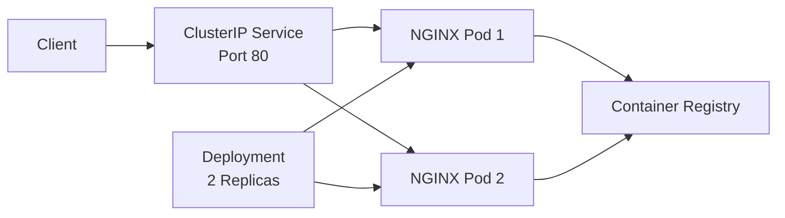

# 📦 Stage 01 — Kubernetes ImagePullBackOff Troubleshooting

A production-style Kubernetes troubleshooting lab that demonstrates how to diagnose and resolve an `ImagePullBackOff` incident caused by an invalid container image reference.

This stage intentionally deploys a broken Kubernetes Deployment that references a nonexistent NGINX image tag. The Pods fail before the containers start, allowing you to practice troubleshooting with Pod status, Events, Deployment configuration, image inspection, rollout validation, and Service testing.

---

## 📖 Table of Contents

* [Overview](#-overview)
* [Learning Objectives](#-learning-objectives)
* [Architecture](#-architecture)
* [Repository Structure](#-repository-structure)
* [Technologies Used](#-technologies-used)
* [Incident Scenario](#-incident-scenario)
* [Broken Deployment](#-broken-deployment)
* [Investigation Workflow](#-investigation-workflow)
* [Root Cause](#-root-cause)
* [Resolution](#-resolution)
* [Validation](#-validation)
* [Evidence Collection](#-evidence-collection)
* [Cleanup](#-cleanup)
* [Skills Demonstrated](#-skills-demonstrated)
* [Lessons Learned](#-lessons-learned)
* [Resume Highlights](#-resume-highlights)

---

## 📌 Overview

`ImagePullBackOff` occurs when Kubernetes cannot download a container image and repeatedly delays additional pull attempts.

It is usually caused by:

* An invalid image name
* A nonexistent image tag
* A private registry authentication failure
* A missing `imagePullSecret`
* A registry outage
* Node DNS or network problems
* Registry rate limiting
* Certificate or trust issues

In this lab, the Deployment references an invalid NGINX image tag:

```text
nginx:version-does-not-exist
```

Kubernetes creates the Pods, but the containers never start because the image cannot be downloaded.

> [!NOTE]
> This failure is intentionally created for troubleshooting practice.

---

## 🎯 Learning Objectives

After completing this stage, you will be able to:

* Reproduce an `ErrImagePull` and `ImagePullBackOff` incident
* Distinguish image-pull failures from application crashes
* Inspect Pod and Deployment status
* Use Kubernetes Events to identify image errors
* Extract image references with JSONPath
* Understand why application logs may be unavailable
* Correct an invalid image reference
* Validate a successful Deployment rollout
* Verify Service endpoints and application connectivity
* Document the incident with a runbook and incident report

---

## 🏗 Architecture



### Broken state

```text
Deployment created
      |
      v
Pod scheduled
      |
      v
Node attempts image pull
      |
      v
Image tag does not exist
      |
      v
ErrImagePull
      |
      v
ImagePullBackOff
```

### Fixed state

```text
Valid image tag configured
      |
      v
Image downloaded successfully
      |
      v
Containers start
      |
      v
Readiness probe passes
      |
      v
Pods become Ready
```

---

## 📁 Repository Structure

```text
01-imagepullbackoff/
├── broken-deployment.yaml
├── fixed-deployment.yaml
├── service.yaml
├── incident-report.md
├── runbook.md
├── README.md
├── pods-after-fix.txt
├── deployment-after-fix.txt
└── events.txt
```

Your exact evidence files may vary depending on how you organized the repository.

---

## 🛠 Technologies Used

| Category                 | Technology                    |
| ------------------------ | ----------------------------- |
| Container Platform       | Docker                        |
| Container Orchestration  | Kubernetes                    |
| Local Kubernetes Cluster | kind                          |
| Command-Line Tool        | kubectl                       |
| Application Image        | NGINX Alpine                  |
| Service Type             | ClusterIP                     |
| Health Monitoring        | Readiness and Liveness Probes |
| Version Control          | Git and GitHub                |
| Documentation            | Markdown                      |

---

## 🚨 Incident Scenario

A new application version is deployed, but the Deployment contains an invalid image tag:

```yaml
containers:
  - name: web
    image: nginx:version-does-not-exist
    imagePullPolicy: Always
```

Because the tag does not exist in the registry, Kubernetes cannot download the image.

The Pods transition through:

```text
Pending
ErrImagePull
ImagePullBackOff
```

The containers never start, so the application has zero available replicas.

---

## 🔴 Broken Deployment

Deploy the broken manifest:

```bash
kubectl apply -f broken-deployment.yaml
```

Check the Deployment:

```bash
kubectl get deployment image-pull-demo
```

Check the Pods:

```bash
kubectl get pods -l app=image-pull-demo
```

Expected:

```text
READY   STATUS             RESTARTS
0/1     ImagePullBackOff   0
0/1     ImagePullBackOff   0
```

The status may briefly appear as:

```text
ErrImagePull
```

before changing to:

```text
ImagePullBackOff
```

---

## 🔍 Investigation Workflow

The lab follows this troubleshooting sequence:

```text
Incident detected
       |
       v
Check Deployment status
       |
       v
Check Pod status
       |
       v
Describe the failing Pod
       |
       v
Review Kubernetes Events
       |
       v
Inspect configured image
       |
       v
Confirm logs are unavailable
       |
       v
Identify invalid image tag
       |
       v
Apply corrected image
```

---

### 1. Check Deployment availability

```bash
kubectl get deployment image-pull-demo
```

A failed Deployment may show:

```text
READY   UP-TO-DATE   AVAILABLE
0/2     2            0
```

Describe it:

```bash
kubectl describe deployment image-pull-demo
```

Review:

* Desired replicas
* Available replicas
* Container image
* Deployment conditions
* ReplicaSet events

---

### 2. Inspect the Pods

```bash
kubectl get pods \
  -l app=image-pull-demo \
  -o wide
```

Key fields:

* `STATUS`
* `READY`
* `RESTARTS`
* `NODE`

Unlike `CrashLoopBackOff`, the restart count normally remains `0` because the container never starts.

---

### 3. Store the Pod name

```bash
POD_NAME=$(kubectl get pods \
  -l app=image-pull-demo \
  -o jsonpath='{.items[0].metadata.name}')
```

Verify:

```bash
echo "$POD_NAME"
```

---

### 4. Describe the Pod

```bash
kubectl describe pod "$POD_NAME"
```

Review the Events section.

Typical messages include:

```text
Failed to pull image "nginx:version-does-not-exist"
ErrImagePull
Back-off pulling image
ImagePullBackOff
```

The Events section usually contains the most useful information for this type of incident.

---

### 5. Review recent Events

```bash
kubectl get events \
  --sort-by=.metadata.creationTimestamp
```

Filter by the affected Pod:

```bash
kubectl get events \
  --field-selector involvedObject.name="$POD_NAME" \
  --sort-by=.metadata.creationTimestamp
```

---

### 6. Inspect the configured image

```bash
kubectl get deployment image-pull-demo \
  -o jsonpath='{.spec.template.spec.containers[*].image}{"\n"}'
```

Expected:

```text
nginx:version-does-not-exist
```

You can also inspect the full Deployment:

```bash
kubectl get deployment image-pull-demo -o yaml
```

---

### 7. Attempt to read logs

```bash
kubectl logs "$POD_NAME"
```

The command will likely fail because the container never started.

This is an important distinction:

```text
ImagePullBackOff:
The image could not be downloaded, so no application process started.

CrashLoopBackOff:
The container started, the application failed, and logs may be available.
```

For image-pull failures, Kubernetes Events are usually more useful than application logs.

---

## 🧩 Root Cause

The Deployment referenced an image tag that did not exist:

```text
nginx:version-does-not-exist
```

Kubernetes attempted to download the image, but the registry could not find the requested tag.

Because the image was unavailable:

1. The Pod was created.
2. The node attempted to pull the image.
3. The registry returned an image-not-found error.
4. Kubernetes reported `ErrImagePull`.
5. Repeated attempts triggered `ImagePullBackOff`.
6. The Deployment had zero available replicas.

Root-cause statement:

```text
The Deployment referenced the nonexistent container image tag
nginx:version-does-not-exist. Kubernetes could not download the image from
the registry, causing the Pods to enter ErrImagePull and ImagePullBackOff.
```

---

## ✅ Resolution

The Deployment was updated to use a valid image:

```yaml
containers:
  - name: web
    image: nginx:1.27-alpine
    imagePullPolicy: IfNotPresent
```

The fixed Deployment also includes:

* Resource requests and limits
* Readiness probe
* Liveness probe
* RollingUpdate strategy
* Multiple replicas

Apply the correction:

```bash
kubectl apply -f fixed-deployment.yaml
```

Watch the rollout:

```bash
kubectl rollout status deployment/image-pull-demo
```

Expected:

```text
deployment "image-pull-demo" successfully rolled out
```

---

## 🩺 Health Probes

### Readiness Probe

The readiness probe determines whether the Pod can receive Service traffic.

```yaml
readinessProbe:
  httpGet:
    path: /
    port: http
  initialDelaySeconds: 5
  periodSeconds: 5
```

A Pod is not added to Service endpoints until the readiness probe succeeds.

### Liveness Probe

The liveness probe determines whether Kubernetes should restart the container.

```yaml
livenessProbe:
  httpGet:
    path: /
    port: http
  initialDelaySeconds: 15
  periodSeconds: 10
```

---

## 🌐 Service Configuration

A ClusterIP Service exposes the NGINX Pods internally:

```yaml
ports:
  - name: http
    protocol: TCP
    port: 80
    targetPort: http
```

Apply it:

```bash
kubectl apply -f service.yaml
```

Verify:

```bash
kubectl get service image-pull-demo
kubectl get endpoints image-pull-demo
```

The endpoint list should include both Ready Pod IP addresses.

---

## ✅ Validation

The incident is considered resolved when:

| Resource or Test  | Expected Result     |
| ----------------- | ------------------- |
| Deployment        | `2/2` Ready         |
| Pods              | Running             |
| Pod restart count | `0`                 |
| Service           | Available           |
| Endpoints         | Two Ready endpoints |
| HTTP request      | Successful          |
| Active image      | `nginx:1.27-alpine` |

### Check Pods

```bash
kubectl get pods \
  -l app=image-pull-demo
```

Expected:

```text
READY   STATUS    RESTARTS
1/1     Running   0
1/1     Running   0
```

---

### Check the active image

```bash
kubectl get deployment image-pull-demo \
  -o jsonpath='{.spec.template.spec.containers[0].image}{"\n"}'
```

Expected:

```text
nginx:1.27-alpine
```

---

### Check endpoints

```bash
kubectl get endpoints image-pull-demo
```

The Service should display two endpoint addresses.

---

### Port-forward the Service

```bash
kubectl port-forward service/image-pull-demo 8080:80
```

Test from another terminal:

```bash
curl http://localhost:8080
```

Expected: the default NGINX HTML page.

Stop port forwarding with:

```text
Control+C
```

---

### Test from inside Kubernetes

```bash
kubectl run curl-test \
  --image=curlimages/curl:8.12.1 \
  --restart=Never \
  --rm \
  -it \
  -- curl http://image-pull-demo
```

Expected: NGINX HTML.

---

## ↩️ Rollout History

View Deployment history:

```bash
kubectl rollout history deployment/image-pull-demo
```

Check rollout status:

```bash
kubectl rollout status deployment/image-pull-demo
```

A production deployment workflow should preserve rollback capability and validate each revision before promoting it.

---

## 📊 Evidence Collection

Save corrected Pod status:

```bash
kubectl get pods \
  -l app=image-pull-demo \
  -o wide \
  > pods-after-fix.txt
```

Save Deployment information:

```bash
kubectl describe deployment image-pull-demo \
  > deployment-after-fix.txt
```

Save recent Events:

```bash
kubectl get events \
  --sort-by=.metadata.creationTimestamp \
  > events.txt
```

You may also save:

```bash
kubectl get deployment image-pull-demo -o yaml \
  > deployment-after-fix.yaml
```

> [!WARNING]
> Do not commit registry credentials, cloud keys, kubeconfig files, tokens, private certificates, or Kubernetes Secret values.

---

## 🧹 Cleanup

Remove the lab resources:

```bash
kubectl delete deployment image-pull-demo \
  --ignore-not-found

kubectl delete service image-pull-demo \
  --ignore-not-found
```

Verify:

```bash
kubectl get deployment image-pull-demo
kubectl get service image-pull-demo
kubectl get pods -l app=image-pull-demo
```

---

## 🧠 Key Concepts

### ErrImagePull

Kubernetes attempted to pull the image and received an immediate failure.

### ImagePullBackOff

Kubernetes continues retrying the pull but introduces an increasing delay between attempts.

### imagePullPolicy

Common values:

| Value          | Behavior                               |
| -------------- | -------------------------------------- |
| `Always`       | Always contact the registry            |
| `IfNotPresent` | Use a local image if already available |
| `Never`        | Never contact the registry             |

### Container Registry

A registry stores container images and tags. Kubernetes nodes must be able to resolve, authenticate to, and reach the registry.

### imagePullSecret

Private registries usually require credentials stored in a Kubernetes Secret and referenced by the Pod or ServiceAccount.

### Immutable Tags

Production environments often prefer immutable version tags or image digests instead of mutable tags such as `latest`.

---

## 📚 Lessons Learned

* `ImagePullBackOff` is a symptom of a registry or image-reference problem.
* Kubernetes Events are the fastest source of evidence for image-pull failures.
* Application logs may not exist because the container never started.
* Image names, tags, registry URLs, and credentials must be validated before deployment.
* Deployment success should be verified with rollout status, Ready Pods, endpoints, and HTTP testing.
* Using versioned image tags improves reliability and rollback safety.
* Readiness probes prevent traffic from reaching unready containers.
* A clean incident report should separate symptoms, root cause, resolution, and preventive actions.

---

## 🧰 Skills Demonstrated

* Kubernetes Pod troubleshooting
* `ErrImagePull` diagnosis
* `ImagePullBackOff` diagnosis
* Kubernetes Events analysis
* Deployment inspection
* JSONPath queries
* Container image troubleshooting
* Registry failure analysis
* Readiness and liveness probes
* Service and endpoint validation
* Deployment rollout verification
* Root-cause analysis
* Incident documentation
* Git-based project management

---

## 💼 Resume Highlights

**Kubernetes ImagePullBackOff Troubleshooting Lab**

* Built a production-style Kubernetes incident lab reproducing an `ImagePullBackOff` failure caused by an invalid container image tag.
* Diagnosed the issue using Pod status, Deployment configuration, Kubernetes Events, image inspection, and JSONPath queries.
* Distinguished pre-start image failures from application-level container crashes.
* Corrected the image reference, implemented health probes and resource controls, and validated the Deployment rollout.
* Verified application recovery using Service endpoints, port forwarding, and in-cluster HTTP testing.
* Authored a reusable runbook, incident report, evidence files, and cleanup procedure.

---

## 📌 Stage Completion Summary

* [x] Broken Deployment created
* [x] Invalid image tag reproduced
* [x] `ErrImagePull` observed
* [x] `ImagePullBackOff` observed
* [x] Pod Events inspected
* [x] Image reference verified
* [x] Valid image applied
* [x] Health probes configured
* [x] Service created
* [x] Endpoints validated
* [x] HTTP connectivity tested
* [x] Evidence collected
* [x] Runbook created
* [x] Incident report created
