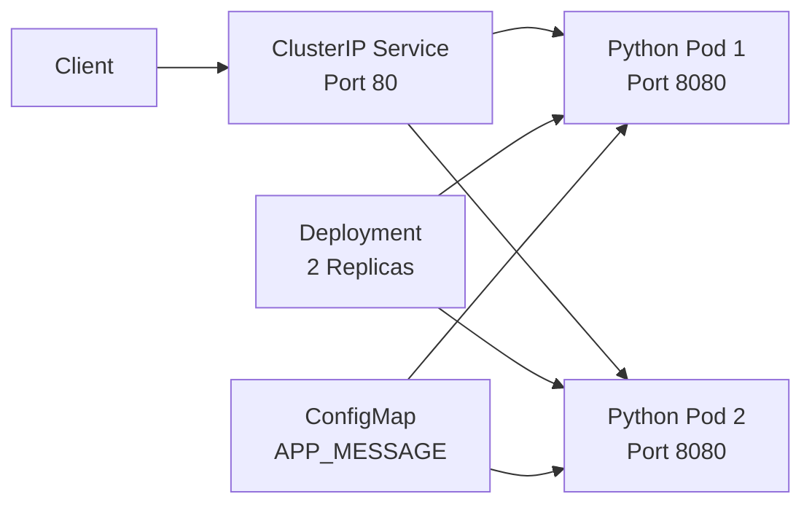

# 🔁 Stage 02 — Kubernetes CrashLoopBackOff Troubleshooting

A production-style Kubernetes troubleshooting lab that demonstrates how to diagnose and resolve a `CrashLoopBackOff` incident caused by missing application configuration.

This stage uses a small Python HTTP application that requires an environment variable during startup. The broken Deployment omits that configuration, causing the container to exit repeatedly. The incident is investigated using Pod status, current logs, previous-container logs, exit codes, Kubernetes Events, and Deployment configuration.

The issue is resolved by loading the required configuration from a ConfigMap and adding startup, readiness, and liveness probes.

---

## 📖 Table of Contents

* [Overview](#-overview)
* [Learning Objectives](#-learning-objectives)
* [Architecture](#-architecture)
* [Repository Structure](#-repository-structure)
* [Technologies Used](#-technologies-used)
* [Incident Scenario](#-incident-scenario)
* [Application Behavior](#-application-behavior)
* [Investigation Workflow](#-investigation-workflow)
* [Root Cause](#-root-cause)
* [Resolution](#-resolution)
* [Health Probes](#-health-probes)
* [Validation](#-validation)
* [Rollback Practice](#-rollback-practice)
* [Evidence Collection](#-evidence-collection)
* [Cleanup](#-cleanup)
* [Skills Demonstrated](#-skills-demonstrated)
* [Lessons Learned](#-lessons-learned)
* [Resume Highlights](#-resume-highlights)

---

## 📌 Overview

`CrashLoopBackOff` indicates that a container starts, fails, restarts, and then enters an increasing restart delay.

It is not the root cause itself. It is a Kubernetes status that shows the container has failed repeatedly.

Common causes include:

* Missing environment variables
* Incorrect startup commands
* Application code errors
* Missing configuration files
* Invalid ConfigMap or Secret references
* Dependency connection failures
* Failed liveness probes
* Permission problems
* Out-of-memory termination

This lab reproduces a configuration-related crash and demonstrates a structured production troubleshooting process.

> [!NOTE]
> The failure in this lab is intentionally created for troubleshooting practice.

---

## 🎯 Learning Objectives

After completing this stage, you will be able to:

* Build and test a containerized Python application
* Reproduce a Kubernetes `CrashLoopBackOff`
* Inspect Pod restart counts and container states
* Read current and previous-container logs
* Identify exit codes and termination reasons
* Inspect application configuration in a Deployment
* Store non-sensitive configuration in a ConfigMap
* Configure startup, readiness, and liveness probes
* Validate application recovery through a Service
* Practice Kubernetes rollout history and rollback
* Document incidents with runbooks and evidence

---

## 🏗 Architecture



### Broken state

```text
Deployment
    |
    v
Python container starts
    |
    v
APP_MESSAGE is missing
    |
    v
Application exits with code 1
    |
    v
Kubernetes restarts container
    |
    v
CrashLoopBackOff
```

### Fixed state

```text
ConfigMap
    |
    v
APP_MESSAGE injected into container
    |
    v
Application starts successfully
    |
    v
Health probes pass
    |
    v
Pod becomes Ready
```

---

## 📁 Repository Structure

```text
02-crashloopbackoff/
├── app/
│   ├── Dockerfile
│   └── app.py
│
├── evidence/
│   ├── application-after-fix.log
│   ├── deployment-after-fix.txt
│   ├── endpoints-after-fix.yaml
│   ├── events.txt
│   └── pods-after-fix.txt
│
├── broken-deployment.yaml
├── cleanup.sh
├── configmap.yaml
├── fixed-deployment.yaml
├── incident-report.md
├── README.md
├── runbook.md
└── service.yaml
```

---

## 🛠 Technologies Used

| Category           | Technology                              |
| ------------------ | --------------------------------------- |
| Application        | Python                                  |
| Container Platform | Docker                                  |
| Container Image    | Python Alpine                           |
| Kubernetes Cluster | kind                                    |
| Orchestration      | Kubernetes                              |
| Command-Line Tool  | kubectl                                 |
| Configuration      | ConfigMap                               |
| Service Type       | ClusterIP                               |
| Health Monitoring  | Startup, Readiness, and Liveness Probes |
| Version Control    | Git and GitHub                          |
| Automation         | Bash                                    |

---

## 🚨 Incident Scenario

The Python application requires the following environment variable:

```text
APP_MESSAGE
```

During startup, the application checks whether the variable exists.

When it is missing, the application logs:

```text
FATAL: Required environment variable APP_MESSAGE is missing.
```

The process then exits with:

```text
Exit Code: 1
```

Because the application is managed by a Deployment, Kubernetes continuously restarts the failed container.

After repeated failures, the Pod enters:

```text
CrashLoopBackOff
```

---

## 🐍 Application Behavior

The application reads the required variable:

```python
APP_MESSAGE = os.getenv("APP_MESSAGE")
```

If the variable is missing:

```python
if not APP_MESSAGE:
    print(
        "FATAL: Required environment variable APP_MESSAGE is missing.",
        flush=True,
    )
    sys.exit(1)
```

When configured correctly, the application starts an HTTP server on port `8080`.

Available endpoints:

| Endpoint  | Purpose                                    |
| --------- | ------------------------------------------ |
| `/`       | Returns the configured application message |
| `/health` | Liveness and startup health check          |
| `/ready`  | Readiness check                            |

---

## 🐳 Container Image

The Dockerfile:

* Uses a lightweight Python Alpine image
* Copies the application into `/app`
* Creates a non-root user
* Runs with numeric UID and GID `10001`
* Exposes port `8080`
* Starts the Python application

Example security configuration:

```dockerfile
USER 10001:10001
```

This allows Kubernetes to verify that the container does not run as root.

Verify inside the Pod:

```bash
kubectl exec <pod-name> -- id
```

Expected:

```text
uid=10001(appuser) gid=10001(appgroup)
```

---

## 🔴 Broken Deployment

The broken Deployment intentionally omits:

```yaml
env:
  - name: APP_MESSAGE
```

The container image is valid and starts successfully, but the application process terminates because required configuration is missing.

Deploy the broken scenario:

```bash
kubectl apply -f broken-deployment.yaml
```

Check the Pods:

```bash
kubectl get pods -l app=crashloop-demo
```

Expected:

```text
READY   STATUS             RESTARTS
0/1     CrashLoopBackOff   3
0/1     CrashLoopBackOff   3
```

The exact restart count may vary.

---

## 🔍 Investigation Workflow

The lab follows this troubleshooting sequence:

```text
Incident Detected
       |
       v
Check Deployment Availability
       |
       v
Inspect Pod Status and Restarts
       |
       v
Describe the Pod
       |
       v
Read Current Logs
       |
       v
Read Previous-Container Logs
       |
       v
Inspect Exit Code
       |
       v
Review Deployment Configuration
       |
       v
Identify Root Cause
```

---

### 1. Check Deployment status

```bash
kubectl get deployment crashloop-demo
```

A failed rollout may show:

```text
READY   UP-TO-DATE   AVAILABLE
0/2     2            0
```

Describe it:

```bash
kubectl describe deployment crashloop-demo
```

---

### 2. Check the Pods

```bash
kubectl get pods \
  -l app=crashloop-demo \
  -o wide
```

Key fields:

* `STATUS`
* `READY`
* `RESTARTS`
* `NODE`

---

### 3. Store the Pod name

```bash
POD_NAME=$(kubectl get pods \
  -l app=crashloop-demo \
  -o jsonpath='{.items[0].metadata.name}')
```

Verify:

```bash
echo "$POD_NAME"
```

---

### 4. Describe the Pod

```bash
kubectl describe pod "$POD_NAME"
```

Review:

```text
State
Last State
Reason
Exit Code
Restart Count
Events
```

Typical output:

```text
Last State:  Terminated
Reason:      Error
Exit Code:   1
```

---

### 5. Read current logs

```bash
kubectl logs "$POD_NAME"
```

Expected:

```text
FATAL: Required environment variable APP_MESSAGE is missing.
```

---

### 6. Read previous-container logs

```bash
kubectl logs "$POD_NAME" --previous
```

This is one of the most important commands for investigating containers that restart repeatedly.

For a multi-container Pod:

```bash
kubectl logs "$POD_NAME" \
  -c application \
  --previous
```

---

### 7. Inspect exit code and reason

```bash
kubectl get pod "$POD_NAME" \
  -o jsonpath='Exit code: {.status.containerStatuses[0].lastState.terminated.exitCode}{"\n"}Reason: {.status.containerStatuses[0].lastState.terminated.reason}{"\n"}Restarts: {.status.containerStatuses[0].restartCount}{"\n"}'
```

Expected:

```text
Exit code: 1
Reason: Error
Restarts: 4
```

---

### 8. Inspect environment configuration

```bash
kubectl set env deployment/crashloop-demo --list
```

Inspect the Deployment:

```bash
kubectl get deployment crashloop-demo -o yaml
```

The required environment variable is absent.

---

### 9. Review Events

```bash
kubectl get events \
  --sort-by=.metadata.creationTimestamp
```

Filter by the Pod:

```bash
kubectl get events \
  --field-selector involvedObject.name="$POD_NAME" \
  --sort-by=.metadata.creationTimestamp
```

Typical event:

```text
Back-off restarting failed container
```

---

## 🧩 Root Cause

The application required the `APP_MESSAGE` environment variable during startup.

The Kubernetes Deployment did not provide that variable.

As a result:

1. The container started.
2. The Python application detected missing configuration.
3. The process logged a fatal error.
4. The process exited with code `1`.
5. Kubernetes restarted the container.
6. Repeated failures resulted in `CrashLoopBackOff`.

Root-cause statement:

```text
The crashloop-demo application required the APP_MESSAGE environment variable
during startup. The Deployment did not define the variable, causing the
application process to exit with status code 1. Kubernetes repeatedly restarted
the container and applied a restart backoff, resulting in CrashLoopBackOff.
```

---

## ✅ Resolution

A ConfigMap stores the required non-sensitive configuration:

```yaml
apiVersion: v1
kind: ConfigMap
metadata:
  name: crashloop-demo-config
data:
  APP_MESSAGE: "CrashLoopBackOff incident successfully resolved"
```

The fixed Deployment loads the value using:

```yaml
env:
  - name: APP_MESSAGE
    valueFrom:
      configMapKeyRef:
        name: crashloop-demo-config
        key: APP_MESSAGE
```

Apply the fix:

```bash
kubectl apply -f configmap.yaml
kubectl apply -f fixed-deployment.yaml
```

Watch the rollout:

```bash
kubectl rollout status deployment/crashloop-demo
```

Expected:

```text
deployment "crashloop-demo" successfully rolled out
```

---

## 🩺 Health Probes

The fixed Deployment includes three probe types.

### Startup Probe

The startup probe gives the application time to initialize.

```yaml
startupProbe:
  httpGet:
    path: /health
    port: http
  periodSeconds: 2
  failureThreshold: 15
```

Until it succeeds, Kubernetes does not run the readiness or liveness probes.

---

### Readiness Probe

The readiness probe controls whether the Pod can receive Service traffic.

```yaml
readinessProbe:
  httpGet:
    path: /ready
    port: http
  periodSeconds: 5
```

A failed readiness probe removes the Pod from Service endpoints without necessarily restarting it.

---

### Liveness Probe

The liveness probe checks whether the application is still functioning.

```yaml
livenessProbe:
  httpGet:
    path: /health
    port: http
  periodSeconds: 10
```

Repeated failures cause Kubernetes to restart the container.

---

## 🌐 Service Configuration

A ClusterIP Service exposes the application internally:

```yaml
ports:
  - name: http
    port: 80
    targetPort: http
```

Apply it:

```bash
kubectl apply -f service.yaml
```

Verify:

```bash
kubectl get service crashloop-demo
kubectl get endpoints crashloop-demo
```

The endpoints should contain both Ready Pod IP addresses.

---

## ✅ Validation

The incident is considered resolved when:

| Resource or Test      | Expected Result            |
| --------------------- | -------------------------- |
| Deployment            | `2/2` Ready                |
| Pods                  | Running                    |
| New Pod restart count | `0`                        |
| Service               | Available                  |
| Endpoints             | Two Ready endpoints        |
| Root endpoint         | Returns configured message |
| `/health`             | Returns `healthy`          |
| `/ready`              | Returns `ready`            |

### Check Pods

```bash
kubectl get pods \
  -l app=crashloop-demo
```

Expected:

```text
READY   STATUS    RESTARTS
1/1     Running   0
1/1     Running   0
```

---

### Check logs

```bash
POD_NAME=$(kubectl get pods \
  -l app=crashloop-demo \
  -o jsonpath='{.items[0].metadata.name}')

kubectl logs "$POD_NAME"
```

Expected:

```text
Application started successfully on port 8080.
APP_MESSAGE=CrashLoopBackOff incident successfully resolved
```

---

### Port-forward the Service

```bash
kubectl port-forward service/crashloop-demo 8080:80
```

Test from another terminal:

```bash
curl http://localhost:8080
curl http://localhost:8080/health
curl http://localhost:8080/ready
```

Expected:

```text
CrashLoopBackOff incident successfully resolved
healthy
ready
```

---

### Test from inside Kubernetes

```bash
kubectl run curl-test \
  --image=curlimages/curl:8.12.1 \
  --restart=Never \
  --rm \
  -it \
  -- curl http://crashloop-demo
```

Expected:

```text
CrashLoopBackOff incident successfully resolved
```

---

## ↩️ Rollback Practice

View rollout history:

```bash
kubectl rollout history deployment/crashloop-demo
```

Inspect a revision:

```bash
kubectl rollout history \
  deployment/crashloop-demo \
  --revision=1
```

Roll back to an earlier revision:

```bash
kubectl rollout undo \
  deployment/crashloop-demo \
  --to-revision=1
```

Restore the fixed version:

```bash
kubectl apply -f fixed-deployment.yaml
```

> [!WARNING]
> Rolling back to the broken revision intentionally reproduces the incident.

---

## 📊 Evidence Collection

The `evidence/` directory contains outputs captured after remediation.

Save Pod status:

```bash
kubectl get pods \
  -l app=crashloop-demo \
  -o wide \
  > evidence/pods-after-fix.txt
```

Save Deployment details:

```bash
kubectl describe deployment crashloop-demo \
  > evidence/deployment-after-fix.txt
```

Save endpoints:

```bash
kubectl get endpoints crashloop-demo \
  -o yaml \
  > evidence/endpoints-after-fix.yaml
```

Save application logs:

```bash
kubectl logs "$POD_NAME" \
  > evidence/application-after-fix.log
```

Save Events:

```bash
kubectl get events \
  --sort-by=.metadata.creationTimestamp \
  > evidence/events.txt
```

> [!WARNING]
> Do not commit Secrets, tokens, kubeconfig files, private keys, registry credentials, or cloud-provider credentials.

---

## 🧹 Cleanup

Run:

```bash
./cleanup.sh
```

The script removes:

* `crashloop-demo` Deployment
* `crashloop-demo` Service
* `crashloop-demo-config` ConfigMap

Verify:

```bash
kubectl get deployment crashloop-demo
kubectl get service crashloop-demo
kubectl get configmap crashloop-demo-config
```

---

## 🧠 Key Concepts

### CrashLoopBackOff

A status showing that a container repeatedly starts and fails, with Kubernetes delaying later restart attempts.

### Exit Code

The process exit code helps identify the type of failure.

Common examples:

| Exit Code | Meaning                                                  |
| --------: | -------------------------------------------------------- |
|       `0` | Successful completion                                    |
|       `1` | General application failure                              |
|     `126` | Command cannot be executed                               |
|     `127` | Command not found                                        |
|     `137` | Process killed, commonly associated with memory pressure |
|     `143` | Process terminated with SIGTERM                          |

Exit codes should always be interpreted with logs, Events, and Pod state.

### Previous Logs

```bash
kubectl logs <pod> --previous
```

Returns logs from the previously terminated container instance.

### ConfigMap

Stores non-sensitive configuration separately from the application image.

### Restart Count

An increasing restart count indicates repeated container failure.

### Readiness vs. Liveness

* Readiness controls traffic eligibility.
* Liveness controls container restart.
* Startup protects slow-starting applications from premature health-check failures.

---

## 📚 Lessons Learned

* `CrashLoopBackOff` is a symptom, not the root cause.
* Current and previous-container logs are essential during investigation.
* Exit code `1` must be interpreted with application logs.
* Missing configuration can prevent an otherwise valid image from running.
* ConfigMaps help separate application configuration from container images.
* Health probes improve availability but must be configured carefully.
* A successful rollout should be validated with logs, endpoints, and real requests.
* Containers should run as non-root using a numeric UID.

---

## 🧰 Skills Demonstrated

* Kubernetes Pod lifecycle troubleshooting
* `CrashLoopBackOff` diagnosis
* Current and previous-container logs
* Container exit-code analysis
* ConfigMaps
* Environment-variable injection
* Startup, readiness, and liveness probes
* Non-root container security
* Docker image creation
* kind image loading
* Service and endpoint validation
* Kubernetes rollout history and rollback
* Root-cause analysis
* Incident documentation
* Git-based project management

---

## 💼 Resume Highlights

**Kubernetes CrashLoopBackOff Troubleshooting Lab**

* Built a containerized Python application and deployed it to a multi-node Kubernetes environment.
* Reproduced a `CrashLoopBackOff` incident caused by missing runtime configuration.
* Diagnosed repeated container failures using Pod status, restart counts, Events, current logs, previous-container logs, and exit-code inspection.
* Resolved the incident by injecting configuration from a ConfigMap and implementing startup, readiness, and liveness probes.
* Enforced non-root execution using numeric UID and GID values.
* Validated recovery through Deployment rollout status, Service endpoints, application logs, in-cluster requests, and health-check testing.
* Authored a reusable troubleshooting runbook, incident report, evidence files, and cleanup automation.

---

## 📌 Stage Completion Summary

* [x] Python application created
* [x] Docker image built
* [x] Non-root image configured
* [x] Broken Deployment reproduced
* [x] CrashLoopBackOff investigated
* [x] Current logs reviewed
* [x] Previous-container logs reviewed
* [x] Exit code inspected
* [x] ConfigMap created
* [x] Health probes added
* [x] Service connectivity validated
* [x] Rollback procedure practiced
* [x] Evidence collected
* [x] Cleanup automation created
