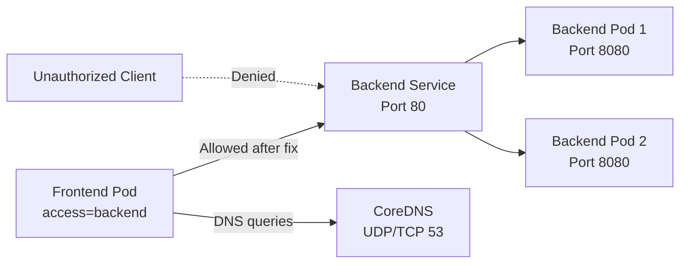

# 🔐 Stage 05 — Kubernetes NetworkPolicy Troubleshooting

A production-style Kubernetes networking and security lab that demonstrates how to diagnose and resolve application connectivity failures caused by `NetworkPolicy` misconfiguration.

This stage uses a dedicated kind cluster with Calico to enforce Kubernetes NetworkPolicies and reproduce realistic incidents involving:

* Default-deny ingress
* Incorrect Pod selectors
* DNS blocked by egress restrictions
* Least-privilege frontend-to-backend communication
* Unauthorized workload isolation

---

## 📖 Table of Contents

* [Overview](#-overview)
* [Learning Objectives](#-learning-objectives)
* [Architecture](#-architecture)
* [Repository Structure](#-repository-structure)
* [Technologies Used](#-technologies-used)
* [Prerequisites](#-prerequisites)
* [Lab Environment](#-lab-environment)
* [Incident Scenarios](#-incident-scenarios)
* [Troubleshooting Workflow](#-troubleshooting-workflow)
* [Validation](#-validation)
* [Evidence Collection](#-evidence-collection)
* [Cleanup](#-cleanup)
* [Skills Demonstrated](#-skills-demonstrated)
* [Lessons Learned](#-lessons-learned)
* [Resume Highlights](#-resume-highlights)

---

## 📌 Overview

Kubernetes Pods can be healthy, Services can have valid endpoints, and DNS can resolve correctly while application traffic still fails because of NetworkPolicy rules.

This lab demonstrates how to separate application, service discovery, DNS, and network-security problems during troubleshooting.

A small application environment is deployed with:

* A frontend client
* A backend application
* A backend ClusterIP Service
* An unauthorized test client
* Calico NetworkPolicy enforcement

Broken policies are intentionally introduced, investigated, corrected, and validated using a repeatable incident-response workflow.

> [!NOTE]
> This is a controlled troubleshooting lab. The failures are intentionally created to simulate real production incidents.

---

## 🎯 Learning Objectives

After completing this stage, you will be able to:

* Build a kind cluster with Calico networking
* Explain how Kubernetes NetworkPolicies isolate Pods
* Troubleshoot frontend-to-backend connectivity
* Distinguish DNS failures from TCP connectivity failures
* Diagnose incorrect Pod selectors
* Implement default-deny policies
* Configure least-privilege ingress and egress access
* Allow DNS using UDP and TCP port 53
* Validate authorized and unauthorized traffic paths
* Collect evidence and document root causes professionally

---

## 🏗 Architecture



### Expected final traffic flow

```text
Frontend Pod
    |
    | DNS query: UDP/TCP 53
    v
CoreDNS

Frontend Pod
    |
    | HTTP request
    v
Backend Service
    |
    v
Backend Pods

Unauthorized Client
    |
    | Connection denied
    X
Backend Service
```

---

## 📁 Repository Structure

```text
05-networkpolicy/
├── cluster/
│   └── kind-calico-config.yaml
│
├── base/
│   ├── namespace.yaml
│   ├── backend.yaml
│   ├── backend-service.yaml
│   ├── frontend.yaml
│   └── unauthorized-client.yaml
│
├── 01-default-deny/
│   ├── broken-policy.yaml
│   └── fixed-policy.yaml
│
├── 02-selector-mismatch/
│   ├── broken-policy.yaml
│   └── fixed-policy.yaml
│
├── 03-dns-blocked/
│   ├── default-deny-egress.yaml
│   └── allow-dns-and-backend.yaml
│
├── evidence/
│   ├── calico-status.txt
│   ├── dns-after-fix.txt
│   ├── frontend-access-allowed.txt
│   ├── networkpolicies-after-fix.yaml
│   ├── pods-after-fix.txt
│   ├── services-and-endpoints.txt
│   └── unauthorized-access-denied.txt
│
├── cleanup.sh
├── incident-report.md
├── runbook.md
└── README.md
```

---

## 🛠 Technologies Used

| Category             | Technology               |
| -------------------- | ------------------------ |
| Container Platform   | Docker                   |
| Kubernetes Cluster   | kind                     |
| Container Networking | Calico                   |
| Orchestration        | Kubernetes               |
| Command-Line Tool    | kubectl                  |
| Backend Application  | NGINX Unprivileged       |
| Connectivity Testing | curl, nslookup           |
| Security Control     | Kubernetes NetworkPolicy |
| Version Control      | Git and GitHub           |
| Automation           | Bash                     |

---

## ✅ Prerequisites

Install and verify:

```bash
docker --version
kubectl version --client
kind version
git --version
```

The lab requires internet access during cluster setup so Calico and container images can be downloaded.

---

## 🌐 Lab Environment

This stage uses a dedicated kind cluster because the default kind networking implementation may not provide the policy behavior required for this lab.

Cluster name:

```text
networkpolicy-lab
```

Namespace:

```text
network-policy-lab
```

Create the cluster:

```bash
kind create cluster \
  --name networkpolicy-lab \
  --config cluster/kind-calico-config.yaml
```

Confirm the active context:

```bash
kubectl config current-context
```

Expected:

```text
kind-networkpolicy-lab
```

Verify nodes:

```bash
kubectl get nodes
```

Verify Calico:

```bash
kubectl get pods -n calico-system
```

All required Calico components should be in the `Running` state before continuing.

---

## 🚨 Incident Scenarios

# Scenario 01 — Default-Deny Ingress

## Problem

The backend Pods are healthy, the Service exists, and endpoints are present, but all client connections time out.

The following policy selects the backend and denies all ingress:

```yaml
spec:
  podSelector:
    matchLabels:
      app: backend
  policyTypes:
    - Ingress
  ingress: []
```

## Symptoms

```bash
kubectl get pods
```

Pods appear healthy:

```text
Running
```

The Service and endpoints also exist:

```bash
kubectl get service backend
kubectl get endpoints backend
```

However, the frontend request fails:

```bash
kubectl exec "$FRONTEND_POD" -- \
  curl --max-time 5 http://backend
```

Expected failure:

```text
curl: (28) Connection timed out
```

## Root Cause

The backend Pods became ingress-isolated because a NetworkPolicy selected them and contained no allow rules.

## Resolution

A least-privilege ingress policy was added to allow only Pods with:

```text
access=backend
```

to connect to backend port `8080`.

```yaml
ingress:
  - from:
      - podSelector:
          matchLabels:
            access: backend
    ports:
      - protocol: TCP
        port: 8080
```

## Final Result

| Source              | Backend Access |
| ------------------- | -------------: |
| Frontend Pod        |      ✅ Allowed |
| Unauthorized Client |       ❌ Denied |

---

# Scenario 02 — Pod Selector Mismatch

## Problem

An allow policy exists, but the approved frontend still cannot connect.

The policy contains a typo:

```yaml
matchLabels:
  access: backned
```

The actual frontend label is:

```yaml
access: backend
```

## Symptoms

The frontend Pod remains healthy, but requests time out.

```bash
kubectl exec "$FRONTEND_POD" -- \
  curl --max-time 5 http://backend
```

## Investigation

Inspect the selector:

```bash
kubectl get networkpolicy backend-allow-frontend \
  -o jsonpath='{.spec.ingress[0].from[0].podSelector.matchLabels}{"\n"}'
```

Search for matching Pods:

```bash
kubectl get pods -l access=backned
```

Expected:

```text
No resources found
```

Search for the correct label:

```bash
kubectl get pods -l access=backend
```

The frontend Pod is returned.

## Root Cause

The NetworkPolicy source selector did not match any Pod because of a spelling error.

## Resolution

The selector was corrected:

```yaml
matchLabels:
  access: backend
```

---

# Scenario 03 — DNS Blocked by Egress Policy

## Problem

A default-deny egress policy is applied to the frontend:

```yaml
spec:
  podSelector:
    matchLabels:
      app: frontend
  policyTypes:
    - Egress
  egress: []
```

The frontend can no longer resolve the backend Service name.

## Symptoms

```bash
kubectl exec "$FRONTEND_POD" -- nslookup backend
```

Expected:

```text
connection timed out
```

Application requests may fail with:

```text
Could not resolve host: backend
```

## Root Cause

The frontend Pod was egress-isolated, and no rule allowed DNS queries to CoreDNS.

## Resolution

The corrected policy allows:

* UDP port 53 to CoreDNS
* TCP port 53 to CoreDNS
* TCP port 8080 to backend Pods

```yaml
egress:
  - to:
      - namespaceSelector:
          matchLabels:
            kubernetes.io/metadata.name: kube-system
        podSelector:
          matchLabels:
            k8s-app: kube-dns
    ports:
      - protocol: UDP
        port: 53
      - protocol: TCP
        port: 53

  - to:
      - podSelector:
          matchLabels:
            app: backend
    ports:
      - protocol: TCP
        port: 8080
```

## Final Result

```text
DNS resolution       ✅ Allowed
Frontend → backend   ✅ Allowed
Unauthorized access  ❌ Denied
Other internet       ❌ Denied
```

---

## 🔍 Troubleshooting Workflow

The lab follows a structured investigation process:

```text
Incident Reported
       |
       v
Check Pod Health
       |
       v
Check Service and Endpoints
       |
       v
Test DNS Resolution
       |
       v
Test TCP Connectivity
       |
       v
Inspect NetworkPolicies
       |
       v
Compare Selectors and Labels
       |
       v
Apply Least-Privilege Fix
       |
       v
Validate Authorized and Denied Traffic
```

### Standard commands

Check Pods:

```bash
kubectl get pods -o wide --show-labels
```

Check Services:

```bash
kubectl get service
```

Check endpoints:

```bash
kubectl get endpoints
```

Inspect NetworkPolicies:

```bash
kubectl get networkpolicy
kubectl describe networkpolicy <policy-name>
```

View policy YAML:

```bash
kubectl get networkpolicy <policy-name> -o yaml
```

Test DNS:

```bash
kubectl exec <pod-name> -- nslookup backend
```

Test HTTP:

```bash
kubectl exec <pod-name> -- \
  curl --silent --show-error --max-time 5 http://backend
```

Check labels:

```bash
kubectl get pods --show-labels
```

Search for matching Pods:

```bash
kubectl get pods -l access=backend
```

---

## ✅ Validation

The stage is complete when the following conditions are met:

| Validation Test                    | Expected Result |
| ---------------------------------- | --------------- |
| Calico components                  | Running         |
| Backend Deployment                 | 2/2 Ready       |
| Backend Service                    | Available       |
| Backend endpoints                  | Two endpoints   |
| Frontend DNS lookup                | Successful      |
| Frontend to backend                | Allowed         |
| Unauthorized client to backend     | Denied          |
| Arbitrary frontend internet access | Denied          |

### Validate approved access

```bash
kubectl exec "$FRONTEND_POD" -- \
  curl --silent --show-error --max-time 5 http://backend
```

Expected: NGINX HTML response.

### Validate denied access

```bash
kubectl exec "$UNAUTHORIZED_POD" -- \
  curl --show-error --max-time 5 http://backend
```

Expected:

```text
Connection timed out
```

### Validate DNS

```bash
kubectl exec "$FRONTEND_POD" -- nslookup backend
```

Expected: the backend Service IP.

---

## 📊 Evidence Collection

The `evidence/` directory contains outputs captured after remediation.

Examples:

```bash
kubectl get pods \
  -o wide \
  --show-labels \
  > evidence/pods-after-fix.txt
```

```bash
kubectl get service,endpoints \
  > evidence/services-and-endpoints.txt
```

```bash
kubectl get networkpolicy \
  -o yaml \
  > evidence/networkpolicies-after-fix.yaml
```

```bash
kubectl exec "$FRONTEND_POD" -- \
  nslookup backend \
  > evidence/dns-after-fix.txt
```

```bash
kubectl exec "$FRONTEND_POD" -- \
  curl --silent --show-error --max-time 5 http://backend \
  > evidence/frontend-access-allowed.txt
```

The unauthorized denial result is also recorded to demonstrate that the least-privilege policy is enforced.

> [!WARNING]
> Do not commit credentials, kubeconfig files, cloud keys, private certificates, or Secret values.

---

## 🧹 Cleanup

Run:

```bash
./cleanup.sh
```

The script removes the dedicated kind cluster:

```text
networkpolicy-lab
```

Verify:

```bash
kind get clusters
```

---

## 🧠 Key Concepts

### Default Deny

A default-deny policy isolates selected Pods and requires explicit allow rules.

### Additive Policies

Multiple policies can select the same Pod. Allowed traffic is the union of all matching allow rules.

### Ingress and Egress

Ingress and egress isolation are evaluated independently.

A connection may require:

* Source Pod egress permission
* Destination Pod ingress permission

### Pod Selectors

Pod selectors rely on labels. A typo can silently cause a policy to match no Pods.

### Namespace Selectors

Namespace selectors allow traffic rules to reference workloads outside the local namespace.

### DNS Requirements

Egress-isolated Pods typically require explicit UDP and TCP port 53 access to CoreDNS.

### Layer 3 and Layer 4 Security

Standard Kubernetes NetworkPolicy controls IP-based and port-based traffic. It does not define HTTP path-level authorization.

---

## 📚 Lessons Learned

* Healthy Pods do not guarantee successful application communication.
* Services and endpoints must be checked before blaming NetworkPolicy.
* DNS and TCP connectivity should be tested independently.
* NetworkPolicy selectors must be compared directly with live Pod labels.
* Default-deny policies should always be paired with documented allow rules.
* DNS access must be included when applying restrictive egress policies.
* Unauthorized traffic should be tested after every security-policy change.
* NetworkPolicy enforcement depends on the cluster CNI.

---

## 🧰 Skills Demonstrated

* Kubernetes networking
* Calico CNI installation
* NetworkPolicy enforcement
* Default-deny security
* Ingress and egress controls
* Pod and namespace selectors
* DNS troubleshooting
* Service and endpoint validation
* Least-privilege networking
* Zero-trust segmentation
* Root cause analysis
* Incident response
* Bash automation
* Git-based infrastructure documentation

---

## 💼 Resume Highlights

**Kubernetes NetworkPolicy Troubleshooting Lab**

* Built a dedicated multi-node kind cluster with Calico to test Kubernetes NetworkPolicy enforcement.
* Reproduced and diagnosed application connectivity failures involving default-deny ingress, selector mismatches, and blocked DNS egress.
* Validated Kubernetes Services, EndpointSlices, CoreDNS resolution, Pod labels, and Layer 3/4 traffic rules during incident investigation.
* Implemented least-privilege policies that allowed approved frontend-to-backend traffic while denying unauthorized workloads.
* Collected troubleshooting evidence and authored reusable runbooks, incident reports, and cleanup automation.

---

## 📌 Stage Completion Summary

* [x] Calico-enabled kind cluster
* [x] Frontend and backend workloads
* [x] Unauthorized client
* [x] Default-deny ingress incident
* [x] Pod selector mismatch incident
* [x] DNS-blocked egress incident
* [x] Least-privilege remediation
* [x] Authorized and denied traffic validation
* [x] Evidence collection
* [x] Cleanup automation
